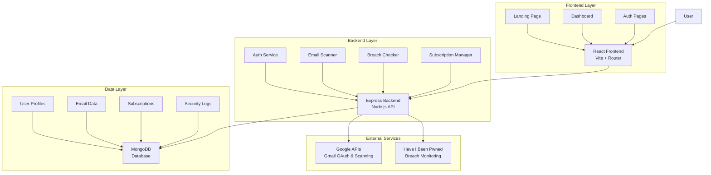

# 🛡️ BreachBuddy - Integrated Gmail Security Scanner

BreachBuddy is a next-generation security dashboard that provides unified control over your digital footprint. This project integrates a comprehensive Gmail scanner and breach monitoring system with a modern React frontend.

## � Table of Contents

- [🚀 Features](#-features)
- [🏗️ Architecture](#️-architecture)
- [🛠️ Tech Stack](#️-tech-stack)
- [📁 Project Structure](#-project-structure)
- [🚀 Getting Started](#-getting-started)
- [🎯 Usage](#-usage)
- [🔧 Available Scripts](#-available-scripts)
- [🔒 Security Features](#-security-features)
- [🌟 Integration Highlights](#-integration-highlights)
- [📄 API Documentation](#-api-documentation)
- [🤝 Contributing](#-contributing)
- [📝 License](#-license)
- [💡 Innovation and Creativity](#-innovation-and-creativity)
- [💰 Monetization Strategy](#-monetization-strategy)
- [📈 Scalability & Growth Potential](#-scalability--growth-potential)

## �🚀 Features

### Landing Page
- Modern, responsive design with smooth animations
- Hero section with call-to-action buttons
- Feature showcase and testimonials
- Direct integration with the Gmail scanner app

### Gmail Scanner & Security Dashboard
- **🔑 Gmail Authentication** → Secure Google OAuth integration
- **📧 AI-Powered Email Scanning** → Detect subscriptions, newsletters, and security threats
- **🔒 Breach Monitoring (HIBP)** → Monitor your email against known data breaches
- **🔐 Two-Factor Authentication** → TOTP-based 2FA with authenticator apps (Google Authenticator, Authy)
- **📊 Subscription Management** → Track and manage all your email subscriptions
- **⚡ Automated Security Checks** → Regular breach monitoring and email analysis
- **📈 Security Dashboard** → Comprehensive overview of your email security posture

## 🏗️ Architecture

BreachBuddy follows a modern web application architecture with clear separation of concerns:



### Architecture Components

- **Frontend**: Single-page React application with routing and state management
- **Backend**: RESTful API server handling business logic and external integrations
- **Database**: MongoDB for persistent data storage with Mongoose ODM
- **Authentication**: JWT-based sessions with Google OAuth and TOTP 2FA
- **Security**: Rate limiting, CORS, input validation, and secure headers
- **Integrations**: Google Gmail API for email access, HIBP API for breach data

## 🛠️ Tech Stack

### Frontend
- **React 19** with Vite
- **React Router DOM** for navigation
- **Framer Motion** for animations
- **GSAP** for advanced animations
- **Lucide React** for icons
- **Axios** for API communication

### Backend
- **Node.js** with Express.js
- **MongoDB** with Mongoose
- **Google APIs** for Gmail integration
- **JWT** for authentication
- **bcryptjs** for password hashing
- **Have I Been Pwned (HIBP) API** for breach checking
- **Helmet** and **express-rate-limit** for security

## 📁 Project Structure

```
LaunchPad-CodeH/
├── src/                          # Frontend source code
│   ├── components/               # React components
│   │   ├── Hero/                # Landing page hero section
│   │   ├── Navbar/              # Navigation components
│   │   ├── Features/            # Feature showcase
│   │   ├── LoadingSpinner/      # Loading components
│   │   └── BreachCheck/         # Breach checking components
│   ├── pages/                   # Application pages
│   │   ├── LandingPage.js       # Gmail app landing
│   │   ├── Dashboard.js         # Main dashboard
│   │   ├── SubscriptionsPage.js # Subscription management
│   │   ├── BreachCheckPage.js   # Breach monitoring
│   │   └── SettingsPage.js      # User settings
│   ├── context/                 # React context providers
│   │   └── AuthContext.js       # Authentication context
│   ├── utils/                   # Utility functions
│   │   └── api.js              # API communication
│   └── App.jsx                  # Main app component
├── backend/                      # Backend API server
│   ├── models/                  # Database models
│   │   ├── User.js             # User schema
│   │   ├── Email.js            # Email schema
│   │   └── Subscription.js     # Subscription schema
│   ├── routes/                  # API routes
│   │   ├── auth.js             # Authentication routes
│   │   ├── emails.js           # Email scanning routes
│   │   ├── subscriptions.js    # Subscription management
│   │   ├── breachCheck.js      # Breach monitoring routes
│   │   └── dashboard.js        # Dashboard data routes
│   ├── services/               # Business logic services
│   │   ├── gmailService.js     # Gmail API integration
│   │   ├── hibpService.js      # HIBP API integration
│   │   └── migrationService.js # Database migrations
│   ├── middleware/             # Express middleware
│   │   └── auth.js            # Authentication middleware
│   └── server.js              # Express server setup
├── docs/                        # Documentation
├── public/                      # Static assets
└── package.json                 # Project dependencies and scripts
```

## 🚀 Getting Started

### Prerequisites
- Node.js (v16 or higher)
- MongoDB (local or cloud instance)
- Google Cloud Project with Gmail API enabled
- Have I Been Pwned API key

### Installation

1. **Clone the repository**
   ```bash
   git clone <repository-url>
   cd launchpad-CodeH
   ```

2. **Install dependencies**
   ```bash
   # Install frontend dependencies
   npm install
   
   # Install backend dependencies
   npm run install:backend
   ```

3. **Configure environment variables**
   
   **Backend (.env in backend/ directory):**
   ```env
   NODE_ENV=development
   PORT=5000
   MONGODB_URI=mongodb://localhost:27017/gmail-subscription-manager
   JWT_SECRET=your_super_secret_jwt_key_here
   GOOGLE_CLIENT_ID=your_google_client_id
   GOOGLE_CLIENT_SECRET=your_google_client_secret
   GOOGLE_REDIRECT_URI=http://localhost:5000/api/auth/google/callback
   HIBP_API_KEY=your_hibp_api_key
   FRONTEND_URL=http://localhost:5173
   ```
   
   **Frontend (.env in root directory):**
   ```env
   VITE_API_URL=http://localhost:5000
   VITE_NODE_ENV=development
   ```

4. **Set up Google OAuth**
   - Go to [Google Cloud Console](https://console.developers.google.com/)
   - Create a new project or select existing one
   - Enable Gmail API
   - Create OAuth 2.0 credentials
   - Add `http://localhost:5000/api/auth/google/callback` to authorized redirect URIs

5. **Get HIBP API Key**
   - Visit [Have I Been Pwned API](https://haveibeenpwned.com/API/Key)
   - Purchase an API key for breach monitoring functionality

### Running the Application

1. **Start the backend server**
   ```bash
   npm run dev:backend
   ```
   Backend will run on http://localhost:5000

2. **Start the frontend development server**
   ```bash
   npm run dev
   ```
   Frontend will run on http://localhost:5173

3. **Access the application**
   - Landing page: http://localhost:5173
   - Gmail scanner app: http://localhost:5173/app
   - Direct login: http://localhost:5173/login

## 🎯 Usage

### Landing Page Flow
1. Visit the main landing page at http://localhost:5173
2. Click "Start Free Scan" or "Get Started" to access the Gmail scanner
3. Sign in with your Google account
4. Grant permissions for Gmail access
5. Dashboard will load with your email analysis

### Gmail Scanner Features
- **Email Scanning**: Automatically analyzes your Gmail for subscriptions and threats
- **Subscription Management**: View, categorize, and manage all email subscriptions  
- **Breach Monitoring**: Check if your email appears in known data breaches
- **Security Dashboard**: Overview of your email security posture
- **Settings**: Configure scan frequency and preferences

## 🔧 Available Scripts

```bash
# Frontend development
npm run dev                 # Start Vite dev server
npm run build              # Build for production
npm run preview            # Preview production build

# Backend development  
npm run dev:backend        # Start backend with nodemon
npm run start:backend      # Start backend in production mode
npm run install:backend    # Install backend dependencies

# Linting
npm run lint               # Run ESLint
```

## 🔒 Security Features

- **Secure Authentication**: Google OAuth 2.0 integration
- **Two-Factor Authentication (2FA)**: TOTP-based authentication with recovery codes
- **JWT Tokens**: Secure session management with temporary 2FA tokens
- **Rate Limiting**: Protection against API abuse
- **CORS Protection**: Secure cross-origin requests
- **Input Validation**: Comprehensive request validation
- **Helmet.js**: Security headers and protection
- **MongoDB Injection Protection**: Mongoose security features
- **Password Hashing**: bcrypt with salt for secure password storage
- **Secure 2FA Storage**: Hashed recovery codes and protected secrets

## 🌟 Integration Highlights

This project successfully integrates:
- ✅ Complete Gmail scanner backend functionality
- ✅ Secure Google OAuth authentication
- ✅ Have I Been Pwned breach monitoring
- ✅ Modern React frontend with animations
- ✅ Responsive design with landing page
- ✅ Comprehensive API endpoints
- ✅ Database models and migrations
- ✅ Security middleware and validation

## 📄 API Documentation

The backend provides RESTful APIs for:
- `/api/auth/*` - Authentication and user management
- `/api/emails/*` - Email scanning and analysis  
- `/api/subscriptions/*` - Subscription management
- `/api/breach-check/*` - Breach monitoring
- `/api/dashboard/*` - Dashboard data and analytics

## 🤝 Contributing

1. Fork the repository
2. Create a feature branch (`git checkout -b feature/amazing-feature`)
3. Commit your changes (`git commit -m 'Add amazing feature'`)
4. Push to the branch (`git push origin feature/amazing-feature`)
5. Open a Pull Request

## 📝 License

This project is licensed under the MIT License - see the LICENSE file for details.

##. Innovation and Creativity

BreachBuddy introduces several innovative aspects compared to typical email scanners or breach-monitoring services:
•	Unified Security Dashboard: Instead of siloed apps for email filtering, breach checking, and subscription management, BreachBuddy combines them in one centralized platform.
•	AI-Powered Email Scanning: Goes beyond keyword filtering by classifying emails into categories like subscriptions, newsletters, and potential phishing attempts.
•	Automated Breach Monitoring: Continuous monitoring of Gmail addresses against the Have I Been Pawned database, with alerts for new breaches.
•	Seamless OAuth Integration: Users authenticate via Google OAuth without sharing credentials, ensuring trust and privacy.
•	Action-Oriented Features: Unlike passive monitoring tools, BreachBuddy empowers users to take action (unsubscribe, secure accounts, manage data exposure).
•	Creative Positioning: The product sits at the intersection of email management and cybersecurity, making security accessible to non-technical users in a visually engaging way.

### Technical Complexity and Functionality
The platform demonstrates significant technical depth and backend–frontend orchestration:
•	Frontend (React 19 + Vite)
o	Single-page application with React Router DOM for navigation.
o	Smooth animations powered by Framer Motion and GSAP for a modern experience.
o	Axios-based API client for communication with backend services.
•	Backend (Node.js + Express)
o	Google APIs Integration: Secure access to Gmail inbox for scanning and classification.
o	MongoDB with Mongoose: Persistent storage for users, emails, and subscription metadata.
o	HIBP API Integration: Automated queries to check for compromised accounts.
o	JWT Authentication + bcrypt.js: Secure user sessions and credential management.
o	Security Middleware: Helmet, rate limiting, and robust input validation.
•	Core Functionalities
o	Email Classification → Identifies subscriptions, newsletters, and suspicious content.
o	Breach Monitoring → Real-time checks with notifications.
o	Subscription Manager → Centralized control of user subscriptions.
o	Dashboard Analytics → Provides a security posture overview with key metrics.
This technical architecture balances scalability, security, and performance, making it a solid foundation for future enhancements like GitHub SaaS integration or multi-platform breach monitoring.

## Impact and Use Case Relevance
The relevance of BreachBuddy is tied to the growing digital threat landscape:
•	Problem it Solves
o	People are overwhelmed with email clutter, subscriptions, and potential phishing attempts.
o	Users often don’t know if their accounts have been compromised in breaches.
o	Security tools are often fragmented and too technical.
•	Target Audience
o	Everyday email users concerned about privacy and data exposure.
o	Small businesses that rely heavily on Gmail and need automated monitoring.
o	Tech-savvy users who want a single dashboard for email + breach insights.
•	Potential Impact
o	Reduces digital fatigue by decluttering inboxes.
o	Enhances security awareness by giving real-time breach notifications.
o	Improves user safety by empowering quick action (unsubscribe, password reset).
o	Bridges the gap between consumer cybersecurity tools and enterprise-level monitoring systems.
•	Future Use Cases
o	Expansion beyond Gmail to include Outlook, Yahoo, or corporate email providers.
o	Integration with password managers or dark web monitoring tools.
o	SaaS model for team email security dashboards in organization


💰 Monetization Strategy

BreachBuddy can be monetized through a flexible freemium + subscription model, making it attractive to both individual users and organizations:

Freemium Tier (Free Forever)

Basic Gmail scanning

Limited breach checks per month

Subscription overview with limited management actions

Premium Individual Plan (Monthly / Yearly Subscription)

Unlimited breach checks across multiple emails

Advanced AI-powered email categorization & phishing detection

Priority breach alerts and notifications

Auto-unsubscribe from unwanted subscriptions

Security recommendations (e.g., strong password tips, MFA reminders)

Business / Team Plan (SaaS Offering)

Multi-user dashboard for teams/companies

Organization-wide Gmail security monitoring

Centralized subscription + breach reporting

Admin controls for bulk unsubscribe and breach notifications

API integration with company systems (e.g., Slack, MS Teams, Jira)

Additional Revenue Channels

API Access – Sell BreachBuddy’s breach-monitoring & email-classification API to third-party developers.

Partnerships – Collaborations with password managers, VPNs, or identity theft protection services.

White-label Solutions – Offer BreachBuddy as a rebranded service for cybersecurity startups.

📈 Scalability & Growth Potential

BreachBuddy is designed with scalable infrastructure and future expansion in mind:

Cloud-Native Architecture → Deploy on AWS/GCP/Azure with auto-scaling for handling millions of users.

Multi-Provider Support → Extend support beyond Gmail to Outlook, Yahoo, ProtonMail, and corporate email servers.

Cross-Platform Integrations → Add security monitoring for GitHub, LinkedIn, Slack, and other SaaS accounts.

AI Enhancements → Improve phishing and spam detection with LLM-powered contextual analysis.

Global Expansion → Multilingual UI and GDPR/CCPA compliance for international users.

Marketplace Presence → Distribute via Chrome Web Store, Google Workspace Marketplace, and mobile apps (iOS & Android).

📌 With this structure, BreachBuddy becomes more than a side project — it evolves into a scalable SaaS security platform with consumer, business, and developer-facing monetization streams.


Saas Product Demo Link :- https://drive.google.com/file/d/1bf8uDhgal4VPtbRmasAdxmKyO1sMzkh-/view?usp=sharing